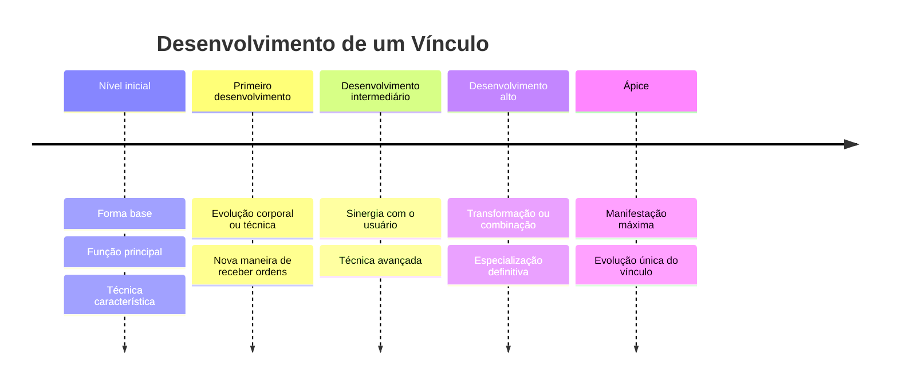
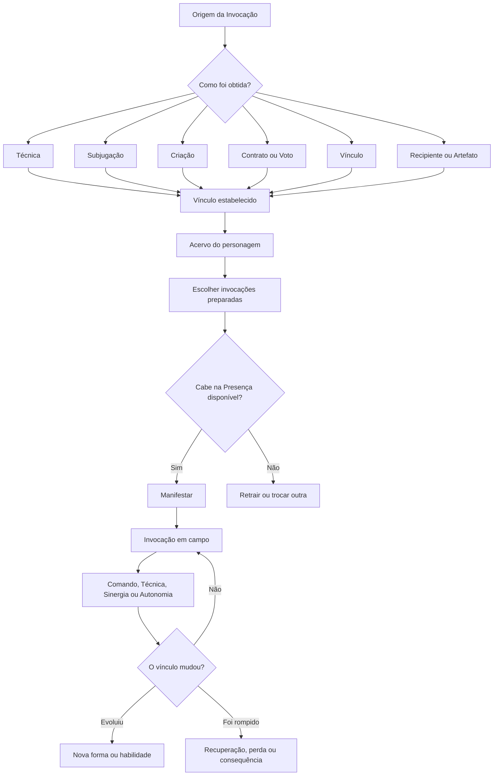
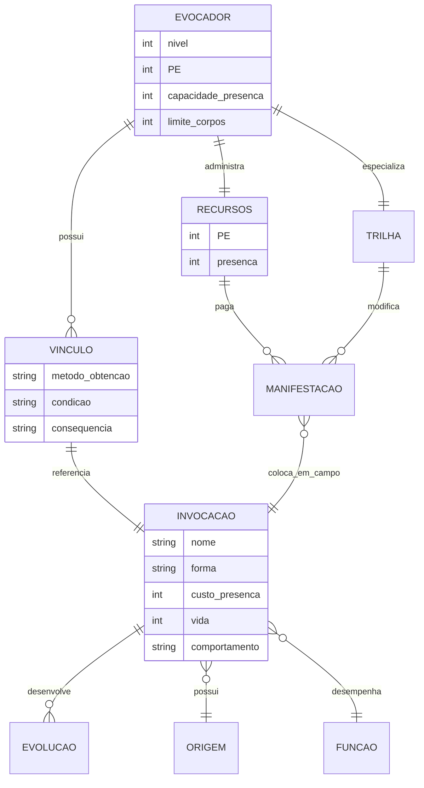

# Redesenho de Invocações e Evocador para o RPG-JJK

## Resumo executivo

A conclusão mais importante da pesquisa é esta:

> **Eu não começaria redesenhando o Evocador. Começaria redesenhando o que significa existir uma Invocação no RPG-JJK.**

O Evocador atual está desatualizado, mas ele é, em grande parte, vítima de uma fundação que não consegue representar a variedade de invocações de *Jujutsu Kaisen*. No ZIP atual, a regra já tenta resolver iniciativa, vida, dano, comandos, orçamento e até cinco corpos em campo; porém, **ela define uma invocação quase sempre como “uma mini-ficha que você comanda”**. Isso é estreito demais para JJK.

O próprio cânone mostra modelos radicalmente diferentes: Megumi herda uma técnica e precisa subjugar shikigami; Geto/Kenjaku adquirem maldições externas e constroem um acervo; Yuta tem uma relação singular com Rika; Dhruv controla dois tipos de shikigami autônomos cuja movimentação é parte da própria técnica; Judgeman é praticamente uma entidade-regra ligada à técnica de Higuruma; Yaga cria corpos amaldiçoados; Kogane é um shikigami de utilidade, não um combatente. citeturn22search2turn22search5turn13search7turn20search2

Essa variedade leva a uma decisão estrutural:

**“Possuir uma invocação” e “ser Evocador” não deveriam significar a mesma coisa.**

O sistema geral de Invocações deve dizer **como entidades são obtidas, construídas, colocadas em campo, comandadas e desenvolvidas**. O Evocador deve ser o personagem que **faz disso seu principal método de lutar**, exatamente como um personagem pode usar armas sem ser Vanguarda, mas o Vanguarda transforma armas e Conduções em sua linguagem de combate.

Minha recomendação para a ordem de trabalho é:

**primeiro, sistema em campo e limite de presença; depois, aquisição e vínculo; por último, progressão e evolução. Só depois disso redesenhamos o Caminho Evocador e suas três Trilhas.**

Há um motivo forte. Não podemos definir quanto custa adquirir uma criatura de Geto, quantas o personagem pode conhecer ou como ela evolui sem saber **quanto vale colocar aquela criatura em campo**. E não podemos escrever as Trilhas “uma”, “duas” e “múltiplas” antes de sabermos exatamente o que um segundo ou terceiro corpo acrescenta à economia de ações.

A pesquisa externa converge muito nesse ponto. Pathfinder 2e evita transformar o Eidolon em um segundo personagem completo ao compartilhar ações entre Summoner e Eidolon; o novo Necromancer de *Impossible Magic* usa thralls de 1 PV que não possuem turnos independentes e só agem quando habilidades do Necromancer mandam; *Draw Steel* construiu seu Summoner explicitamente em torno de minions e de um champion; Diablo IV separa escolha/customização do exército através do Book of the Dead; e o Beastmaster atual de FFXIV distingue claramente **colecionar familiares** de **quantos podem estar convocados ao mesmo tempo**. citeturn6search0turn19search0turn3search9turn19search1turn19search5turn19search7

A solução que considero mais promissora para o RPG-JJK é separar **três números que hoje estão misturados**:

| Conceito | Pergunta que responde |
|---|---|
| **Acervo** | Quantas invocações eu conheço, possuo, criei, domei ou tenho vinculadas? |
| **Preparação/Vínculo** | Quantas delas eu consigo ter prontas para esta missão ou cena? |
| **Presença em Campo** | Quantos corpos e quanto poder posso sustentar simultaneamente? |

Isso permite ter **Geto com uma coleção enorme sem significar Geto com cinquenta fichas no tabuleiro**. Também permite que um personagem tenha dez shikigami conquistados como Megumi, mas escolha quais manifestar em cada momento.

Para o Evocador, as três Trilhas que você já escolheu continuam extremamente boas, mas eu mudaria a linguagem conceitual delas:

| Trilha pretendida | Identidade que eu preservaria |
|---|---|
| **Singular** | Uma entidade poderosa é sua outra metade. Ela protege, luta e evolui profundamente. |
| **Parceiro** | Você e uma ou duas invocações formam uma unidade de combate. As ações de um criam as do outro. |
| **Múltiplas** | Você luta **através da composição, posição e combinação de várias invocações diferentes**, não através de uma “horda de clones”. |

O modelo antigo `Servo / Matilha / Coro` enxergava a diferença principalmente como **quantidade de corpos e divisão matemática de dano**. A versão nova deve enxergar a diferença como **relação entre invocador e invocação**.

Essa é, para mim, a descoberta central desta rodada.

## Diagnóstico do material atual

Li especificamente o sistema que está no ZIP enviado, incluindo `sistema/03-mecanica/15-invocacoes.md`, a versão de manual em `sistema/05-material/livro/manual/60-invocacoes.md` e o Evocador antigo em `35-caminhos-e-trilhas.md`/arquivos de desenvolvimento.

Há boas ideias lá. **Mas concordo com você que a estrutura precisa ser refeita, e não simplesmente corrigida.**

### O que eu salvaria

A primeira coisa que eu salvaria é justamente a que você já escolheu:

> **A invocação deve ser altamente customizável.**

O modelo atual já tenta isso separando atributos, `Traço` e `Comando`, com orçamento crescente. Essa intenção é boa. A execução, porém, coloca quase toda a personalização dentro de um catálogo de pequenas funções: voar, agarrar, buscar, carregar, ficar grande, atacar etc.

A segunda coisa que eu salvaria é:

> **A invocação deve existir fisicamente no campo e ter valor de posição.**

Isso diferencia uma criatura de simplesmente lançar outro feitiço.

A terceira ideia aproveitável é o reconhecimento, já presente no próprio documento antigo, de que **vários corpos não podem significar vários personagens completos**. O documento percebe corretamente o problema de tempo de mesa e de economia de ações.

O problema é **como ele resolveu isso**.

### Onde o sistema antigo começa a se prender

A regra rápida atual é essencialmente:

> Invocar custa PE + Ação Padrão.  
> Comandar custa Ação Padrão.  
> A criatura age depois de você.  
> Sem comando, ela não age.

Isso funciona como mecanismo de contenção de dano, mas produz uma consequência temática ruim:

**na maior parte do tempo, o Invocador não está lutando com a criatura; ele está escolhendo qual das duas fichas joga naquela rodada.**

É um excelente freio matemático, mas uma fantasia de invocador bastante pobre.

Pathfinder 2e resolve um problema parecido de forma mais interessante com **Act Together**: Summoner e Eidolon ainda compartilham a economia de ações, mas o sistema deliberadamente cria espaço para ambos participarem no mesmo turno. Eles também compartilham PV, reforçando que Eidolon e Summoner são duas manifestações de uma mesma unidade de personagem, e não dois personagens independentes. citeturn6search0

### O problema da “Matilha”

No manual atual, a Matilha é:

> **uma ficha, cinco corpos idênticos, uma barra de vida e ataques resolvidos em grupo.**

É uma solução inteligente para performance de mesa, mas **não é a fantasia do Geto que queremos reproduzir**.

Geto/Kenjaku não são interessantes porque colocam cinco cópias da mesma criatura em cinco quadrados.

A identidade de Cursed Spirit Manipulation é a **coleção de entidades diferentes**. O usuário captura maldições e passa a controlá-las; a própria técnica transforma encontros anteriores e criaturas encontradas durante a campanha em repertório futuro. A página oficial do anime descreve Cursed Spirit Manipulation como a técnica de Geto e, no material de personagem, a ideia central é a subjugação/controle de espíritos amaldiçoados. citeturn13search7turn13search12

Então a nova Trilha de múltiplas deveria produzir algo como:

> “Eu trouxe o Rastreador, o Guardião e a maldição que fecha passagens porque esta luta pede exatamente essa composição.”

e não:

> “Tenho cinco corpos iguais porque sou a opção de muitos corpos.”

Esse é um salto enorme de identidade.

### Os tipos atuais quase não são tipos

O sistema antigo reconhece:

- talismã;
- corpo amaldiçoado;
- técnica;
- maldição domada.

Excelente lista conceitual.

Mas mecanicamente, a principal diferença entre esses tipos termina sendo **uma pequena diferença na fórmula de vida**.

Isso desperdiça uma oportunidade enorme.

Uma Maldição Domada deveria ter um processo de aquisição, riscos e consequências completamente diferentes de um Shikigami de Técnica ou de um Corpo Amaldiçoado construído.

No cânone, Yaga pode criar corpos amaldiçoados, Megumi manifesta shikigami de uma técnica herdada, Geto domina espíritos externos e Yuta chega ao universo da invocação através de um vínculo excepcional com Rika. O anime oficial confirma Yaga como criador de corpos amaldiçoados, Megumi como usuário das Dez Sombras e Yuta como alguém cuja entrada no jujutsu foi determinada por Rika. citeturn23search1turn22search2

**Tipo deveria mudar a história e a regra de obtenção. Não somente a quantidade de PV.**

### O Caminho antigo também não tem um ciclo próprio

O Evocador antigo recebe:

`Sintonia → Coleira → Escudo de Osso → Segundo Corpo`.

Essas habilidades melhoram crítico, PV, CD, acerto, proteção e velocidade de invocação.

Nenhuma delas responde com força à pergunta:

> **“O que eu faço repetidamente porque sou Evocador?”**

Depois do nosso trabalho com os outros Caminhos, isso fica ainda mais aparente.

Vanguarda tem sua estrutura de Condução. Emanador trabalha transformação de feitiços. Guia prepara Aberturas.

O Evocador deveria ter um verbo do mesmo nível.

Algo como:

> **Manifestar → Comandar → Combinar → Reposicionar → Retrair/Transformar.**

ou:

> **Vincular → Manifestar → Sincronizar → Evoluir.**

Ainda não precisamos escolher os nomes. Precisamos primeiro construir a máquina que permita esses verbos.

## O que Jujutsu Kaisen realmente ensina sobre invocações

A primeira grande conclusão do levantamento de JJK é que **“invocação” não é uma única categoria rígida dentro da obra**.

Há shikigami, espíritos amaldiçoados controlados, entidades ligadas a técnicas, corpos criados e criaturas que funcionam praticamente como extensões ou subsistemas de uma técnica.

### O mapa funcional do cânone

| Usuário / entidade | Forma de obtenção | Relação | O que ensina ao RPG |
|---|---|---|---|
| **Megumi/Sukuna — Dez Sombras** | Técnica herdada + subjugação das entidades da técnica | repertório limitado de shikigami diferentes | **desbloqueio por ritual**, especialização e perda/evolução |
| **Geto/Kenjaku — Cursed Spirit Manipulation** | derrotar/subjugar e absorver maldições externas | coleção expansível | **captura**, biblioteca de criaturas e escolha do que colocar em campo |
| **Yuta — Rika** | vínculo excepcional, originalmente uma maldição produzida pela relação entre ambos | uma entidade central | **invocação singular como parte da identidade do personagem** |
| **Yuki — Garuda** | shikigami associado à técnica/personagem | parceiro de combate | invocação que luta **junto** do usuário e pode funcionar como extensão de sua técnica |
| **Junpei — Moon Dregs** | manifestação ligada à técnica | shikigami especializado | invocação como **veículo da própria técnica** |
| **Dhruv Lakdawalla** | técnica de shikigami | dois tipos autônomos | movimento/posição das invocações pode ser a própria técnica |
| **Higuruma — Judgeman** | inerente ao funcionamento da técnica/domínio | entidade de julgamento | invocação não precisa existir para “dar ataque” |
| **Yaga — corpos amaldiçoados** | criação | entidades artificiais que podem adquirir autonomia | construção, programação e independência |
| **Kogane** | concedido pelo sistema do Culling Game | familiar/interface | invocações de informação e utilidade |
| **Dagon — shikigami do domínio** | produzidos pelo efeito da técnica/domínio | massa descartável | multidões podem ser **um efeito**, não dezenas de fichas |
| **Toji + espírito de armazenamento** | relação com um espírito externo | criatura e ferramenta ao mesmo tempo | fronteira entre invocação, equipamento e companheiro |
| **Auspicious Beasts de Ino** | técnica mediada pela máscara | manifestações de poderes | nem toda “invocação temática” precisa colocar um segundo personagem no mapa |

Megumi é oficialmente identificado como usuário da técnica hereditária Dez Sombras; materiais oficiais também destacam o uso de shikigami e Mahoraga. A obra explora shikigami com funções muito diferentes, em vez de apenas versões de dano maior do mesmo monstro. citeturn22search2turn13search0turn13search6turn21search23

O detalhe mais importante das Dez Sombras para design é que **o repertório é parte da progressão**. A técnica não é “eu crio uma criatura com 20 pontos”. Ela estabelece uma família de entidades e uma relação de conquista, destruição, combinação e uso situacional. A destruição definitiva e a herança de poder entre shikigami aparecem como parte importante do funcionamento da técnica no mangá e em referências licenciadas/secundárias. citeturn21search23turn21search30

Geto representa a direção oposta: o repertório não é fechado pela técnica; **o mundo alimenta sua coleção**. É por isso que ele é uma referência tão importante para sua terceira Trilha. citeturn13search7turn13search12

Yuta demonstra um terceiro caso: uma única entidade pode ser tão importante que a relação entre personagem e invocação passa a ser a própria fantasia. O site oficial do arco atual registra a manifestação completa de “Rika” durante Sendai; isso é quase o extremo oposto da coleção de Geto. citeturn20search2turn13search10

Dhruv é particularmente importante para nós porque o site oficial descreve explicitamente que ele controla **dois tipos de shikigami autônomos**, e que os trajetos deles constituem seu domínio. Ou seja: uma invocação pode valer pelo **espaço que percorre**, não por seu ataque. citeturn22search2

Higuruma amplia ainda mais a ideia: Judgeman conduz o julgamento dentro da técnica/domínio. Ele não é interessante por “ter 40 PV e causar 5d8”; sua presença muda **as regras da situação**. citeturn22search1turn22search5

E Kogane é oficialmente descrito como um shikigami ligado individualmente aos participantes do Culling Game que funciona como interface com o jogo. Isso prova diretamente que, em JJK, “shikigami” não equivale a “pet de combate”. citeturn22search2

### A taxonomia que eu usaria no RPG

Não classificaria as invocações primeiramente por **espécie**.

Eu as classificaria por **Origem do Vínculo**:

| Origem | Exemplo temático | Como conseguir |
|---|---|---|
| **Técnica** | Dez Sombras | você nasce/desperta com acesso a uma família de invocações |
| **Subjugação** | Geto | encontra uma entidade no mundo e a derrota/domina |
| **Criação** | Yaga | constrói um corpo e insere energia/núcleo |
| **Vínculo** | Rika | a entidade existe por uma relação única com você |
| **Contrato/Voto** | pacto com entidade | termos específicos concedem acesso e impõem consequências |
| **Recipiente** | talismã, objeto ou relíquia | a entidade depende de um objeto que a abriga ou chama |

Depois, independentemente da origem, escolheríamos **o que ela faz em campo**:

`Assalto · Guarda · Controle · Mobilidade · Suporte · Exploração`

E depois **como ela se comporta**:

`Comandada · Semi-autônoma · Autônoma · Extensão`

Essa separação é muito mais poderosa do que “talismã = +1 de vida base”.

### O princípio de JJK que eu considero obrigatório

Uma invocação boa em JJK geralmente tem uma resposta muito clara para:

> **“Por que eu escolheria exatamente esta criatura agora?”**

Cão Divino não precisa cumprir o mesmo papel de Nue. Rabbit Escape não precisa ter o dano do Elefante Máximo. Judgeman não precisa ser um combatente.

Por isso, eu abandonaria a ideia de que toda invocação precisa receber automaticamente um equivalente a `Investir`.

**Ataque deveria ser uma função possível, não a definição universal de Invocação.**

Isso abre espaço para uma criatura que:

- só protege;
- só rastreia;
- constrói uma zona;
- guarda feitiços;
- carrega pessoas;
- altera terreno;
- enfraquece inimigos;
- combina com outra invocação;
- permite ao usuário realizar uma técnica;
- existe para informação.

Essa mudança sozinha já faria o capítulo parecer muito mais JJK.

## O que outros jogos e comunidades resolvem bem

O levantamento externo mostrou algo interessante: **os melhores sistemas não tentam resolver todos os estilos de invocador com a mesma criatura-base**.

Eles escolhem um relacionamento claro entre jogador e unidades.

### Pathfinder e o problema das ações

O Summoner atual de Pathfinder 2e é provavelmente a melhor referência para sua Trilha de **uma invocação forte**.

Summoner e Eidolon compartilham ações e uma mesma reserva de PV; `Act Together` permite distribuir atividades entre os dois sem simplesmente ganhar um segundo turno completo. O Eidolon também não é tratado como um simples minion genérico. citeturn6search0

Isso resolve uma questão fundamental:

> **Duas miniaturas não precisam significar duas economias de ação.**

Já o Necromancer de *Pathfinder: Impossible Magic* é uma referência excelente para o extremo oposto. Seus thralls têm apenas 1 PV, não são minions tradicionais e não ganham turnos completos: eles só realizam ações quando um grave spell ou habilidade do Necromancer manda. citeturn19search0turn19search4

Isso ensina outra coisa:

> **Vários corpos podem existir no mapa sem que cada corpo precise ser uma ficha completa.**

Essa ideia é muito mais interessante para uma futura Trilha de múltiplas do que a Matilha atual.

### Draw Steel — e a correção do nome

O nome que você provavelmente tinha em mente é **Draw Steel**, da MCDM, não “Drawn Steal” nem *Drawn to Death*.

A MCDM lançou oficialmente **The Summoner — Class for Draw Steel**. A própria descrição vende a fantasia como “You Are The Armada”: o Summoner convoca minions que ajudam a segurar inimigos, desgastar ameaças e apoiar o grupo, enquanto também possui a ideia de um **champion** para encerrar confrontos maiores. citeturn3search9turn3search19

Isso é extremamente relevante porque demonstra que **“muitos minions” e “um campeão importante” podem coexistir conceitualmente sem serem a mesma unidade**.

Não copiaria a classe. Mas salvaria essa divisão:

> **unidades de presença** e **entidade de destaque** não precisam obedecer à mesma ficha.

### Diablo IV e o Book of the Dead

O Necromancer de Diablo IV é uma excelente referência para **customização do exército**.

A Blizzard concebeu o Book of the Dead como uma mecânica exclusiva em que diferentes categorias de minions recebem variantes e melhorias, e o jogador historicamente pode escolher entre usar certas tropas ou sacrificar aquela presença por benefícios ao próprio Necromancer. Em 2026, a Blizzard manteve o Book of the Dead e alterou a relação de `Sacrifice`, inclusive permitindo combinações mais flexíveis com minions ativos. citeturn19search1turn19search5

A lição que eu importaria não é um número:

> **Cada invocação deve representar uma escolha entre “poder no corpo” e “poder no invocador”.**

Isso seria fantástico para o Evocador.

Uma invocação retraída poderia, por exemplo, fornecer uma **Manifestação de Vínculo** ao dono.

Assim, retirar uma criatura do campo não significa simplesmente “perdi minha criatura”.

### World of Warcraft e invocações temporárias

Demonology Warlock é construído em torno de chamar ondas de demônios. A própria Blizzard distingue Demonology das outras especializações por sua capacidade de convocar vários demônios, e versões atuais continuam usando janelas temporárias e entidades chamadas por habilidades, em vez de entregar controle manual completo de cada demônio ao jogador. citeturn19search2turn19search17

Essa é uma solução excelente para algo como:

> “Por alguns segundos, dezenas de maldições aparecem.”

**Isso não precisa significar que o jogador ganhou doze fichas.**

Pode ser um ataque, uma zona, uma formação temporária ou uma habilidade de uma invocação maior.

### Girls' Frontline e a fantasia de comandante

*Girls' Frontline* e *Girls' Frontline 2: Exilium* não são sistemas de invocação no sentido literal, mas são ótimos estudos sobre **como fazer o jogador sentir que luta comandando outras entidades**.

GFL2 se apresenta como RPG tático em que o Commander lidera uma equipe de Tactical Dolls; terreno, cobertura e posicionamento são partes importantes do combate. GFL1 trabalha com composição e mobilização de equipes, além de formação e desenvolvimento individual das Dolls. citeturn12search4turn12search7turn12search19

A lição mais forte para nós é:

> **O jogador não precisa realizar pessoalmente as ações mais impressionantes para sentir que está jogando. Ele precisa tomar as decisões que tornam essas ações possíveis.**

Isso combina perfeitamente com a terceira Trilha.

Ela não deveria rolar quatro personagens completos.

Ela deveria decidir:

**quem vai onde, quem combina com quem, quem inicia a sequência e qual invocação será usada para resolver o problema.**

### Final Fantasy XIV e a diferença entre coleção e presença

O Beastmaster de FFXIV, atualizado em setembro de 2026, possui familiares registrados/atribuídos através de seu Bestiary e battlehorns, mas **somente um familiar pode estar invocado por vez**. citeturn19search7

Essa é uma referência excepcional para nosso problema:

> **Quantidade possuída ≠ quantidade preparada ≠ quantidade presente.**

É exatamente a distinção que está faltando no RPG-JJK.

### O que as comunidades repetem

Nas discussões de design, três reclamações aparecem repetidamente quando o assunto é summoner:

**economia de ações**, **tempo de turno** e **perda de identidade**.

Discussões em comunidades de RPG design frequentemente apontam que aumentar o número de criaturas sem limitar suas ações produz tanto problemas de balanceamento quanto turnos longos; soluções recorrentes incluem fazer o invocador trocar suas próprias ações pelas dos minions, resolver vários minions como uma única ação ou limitar fortemente o número de entidades plenamente independentes. citeturn17search1turn17search9turn17search16turn17search31

Outro grupo de comentários valoriza justamente a possibilidade de **ver a criatura mudar mecanicamente e visualmente conforme a campanha progride**. Esse é um ponto frequentemente elogiado em discussões sobre Eidolons. citeturn17search13

Também há uma diferença importante de expectativa: parte da comunidade vê o Summoner de Pathfinder 2e como “o personagem de um Eidolon” e não como “o arquétipo universal de quem invoca várias criaturas”. Isso reforça que tentar encaixar Singular, Parceiro e Colecionador dentro da mesma execução tende a produzir atrito. citeturn17search6turn17search23

Minha síntese dessas discussões seria:

> **Um bom invocador não é aquele que recebe mais turnos. É aquele cujo turno ganha decisões que só existem porque há invocações.**

## Modelos de sistema que podemos aproveitar

Os modelos abaixo **não são mutuamente exclusivos**. Alguns definem combate; outros definem aquisição ou progressão.

Os números são **faixas de protótipo**, não regras aprovadas. Servem para que possamos testar sem começar do zero na próxima rodada.

Para comparar dano, uso `R` como **a Rotina esperada do personagem naquele nível**. Assim não fixamos dados usando a matemática antiga antes de confirmar a régua atual.

### Comparação geral

| Modelo | Custo de mesa | Fidelidade a JJK | Customização | Implementação | Risco de desequilíbrio |
|---|---:|---:|---:|---:|---:|
| **Invocação Singular Forte** | baixo | **muito alta** | alta | fácil-média | médio |
| **Parceiros / uma ou duas** | médio | **muito alta** | **muito alta** | média | médio-alto |
| **Múltiplas Entidades** | alto sem abstração; médio com comandos | **muito alta** | **muito alta** | difícil | **alto** |
| **Esquadrão / Comandante** | médio | alta | alta | média | médio |
| **Contratos e Votos** | baixo | **muito alta** | alta | média | baixo-médio |
| **Invocação-Equipamento** | baixo | alta | média-alta | fácil | baixo |
| **Invocação Evolutiva** | baixo | **muito alta** | **muito alta** | média | médio |

### Invocação Singular Forte

Referências: Eidolon de PF2e, Rika, entidade “campeã”, Mahoraga como extremo.

**Proposta de protótipo:**

| Parâmetro | Faixa inicial |
|---|---|
| Corpos ativos | **1** |
| Manifestação | **2–3 PE** |
| Manutenção | nenhuma por rodada |
| Vida | aproximadamente **80–100% da vida de um personagem de mesmo nível** |
| Saída da criatura | até **0,60–0,70 R** |
| Saída do dono enquanto coordena | aproximadamente **0,30–0,40 R** |
| Técnica especial | **1–4 PE** |
| Evoluções | mais profundas que nas outras rotas |

**Prós:** fácil de administrar; a criatura pode ser personagem de verdade; ótimo vínculo emocional; permite técnicas complexas.

**Contras:** se ambos tiverem ações completas, duplica o personagem; se apenas um agir, cai no problema do Evocador antigo.

A melhor solução parece um mecanismo semelhante conceitualmente a `Act Together`: **ações compartilhadas que permitem que ambos façam algo no mesmo turno sem ganhar dois turnos completos**. citeturn6search0

Mini-cenário:

> A invocação bloqueia a criatura inimiga. O Evocador pode gastar sua Ação Padrão numa Técnica Conjunta: o Servo ataca e ele se move ou realiza uma ação menor. Em outro turno, o Evocador prefere conjurar e manda a criatura somente proteger.

Isso parece **jogar com um parceiro**, não apertar um botão chamado `Comandar`.

### Uma ou duas Invocações com o usuário

Essa é, potencialmente, a Trilha mais dinâmica.

| Parâmetro | Faixa inicial |
|---|---|
| Corpos | 1 no início; **máximo 2** posteriormente |
| Manifestação | **2 PE por invocação comum** |
| Vida individual | cerca de **40–60% da vida de um personagem** |
| Saída total das invocações | **0,35–0,50 R** |
| Saída esperada do usuário | **0,50–0,65 R** |
| Ações | ações combinadas, reações e trocas de posição |
| Técnicas conjuntas | 1–3 PE |

A característica principal não deveria ser “tenho duas”.

Deveria ser:

> **“Minhas ações deixam minha invocação agir e as ações dela deixam eu agir.”**

Yuki e Garuda são um ótimo modelo conceitual: a entidade existe no combate de maneira integrada ao estilo corporal de Yuki, em vez de substituir seus turnos.

Mini-cenário:

> Você atinge o inimigo e abre uma janela. A invocação usa essa abertura para agarrá-lo. Na rodada seguinte você pode usar a criatura presa como ponto para sua própria técnica.

Isso é muito mais rico do que “eu bato e meu pet também bate”.

### Múltiplas Invocações diferentes

Este é o caminho Geto.

Eu colocaria um limite absoluto deliberadamente pequeno.

> **Dois corpos desde cedo, três como padrão de alto nível e quatro como ápice. Não cinco, dez ou vinte fichas completas.**

Grandes massas poderiam existir narrativamente ou como técnicas, zonas e ataques.

| Marco da Trilha | Limite de corpos sugerido |
|---|---:|
| início | **2** |
| desenvolvimento | **3** |
| ápice | **4** |

A saída total de todas as invocações juntas deveria continuar dentro de algo como **0,65–0,80 R**, dependendo de quanto dano pessoal o Evocador conserva.

Cada criatura não deveria receber automaticamente um ataque completo.

Em vez disso, o jogador teria algo como **Ordens**:

`Investir · Cercar · Proteger · Preparar · Combinar · Trocar`

Uma ordem pode envolver várias invocações, mas é **uma resolução de mesa**.

Mini-cenário:

> O Evocador tem um cão rastreador, uma criatura pequena de controle e um espírito pesado.
>
> Ele usa **Cercar**. O rastreador fecha uma saída, a criatura de controle impede recuo e o espírito pesado faz o único ataque da ordem.
>
> São três corpos tomando posições diferentes, mas não três turnos completos.

Esse é, na minha leitura, o ponto em que o sistema pode finalmente fazer Geto direito.

### Esquadrão / Comandante

Inspirado especialmente por GFL e pelo Necromancer de PF2e.

O jogador controla várias unidades, mas elas são operacionalmente uma **formação**.

| Parâmetro | Sugestão |
|---|---|
| Corpos visuais | 2–4 |
| Fichas completas | **1 estrutura compartilhada** |
| Manifestação | **2–4 PE pelo grupo** |
| Vida | Coesão ou barra comum |
| Ataques | uma rolagem ou pool por Ordem |
| Reposicionamento | foco central |
| Poder | muda conforme composição/formação |

É menos indicado para sua Trilha de Geto se quisermos que cada criatura tenha personalidade própria.

Mas pode ser excelente para **invocações menores produzidas por uma criatura maior**.

Um shikigami que solta dezenas de insetos, corvos ou pequenos espíritos pode tratá-los como uma unidade dessas.

### Contratos e Compromissos

Aqui a invocação é obtida através de uma condição.

Exemplos de termos:

> “Só pode ser chamada à noite.”

> “Exige 3 PE adicionais se você estiver ferido.”

> “Recusa ordens contra membros de certo grupo.”

> “Se destruída, fica indisponível até que o contrato seja reparado.”

> “Seu ataque mais forte exige que você aceite uma Restrição.”

Isso combina particularmente bem com o universo de JJK, onde Votos e condições são parte essencial do funcionamento de muitas técnicas.

**Sugestão de balanceamento:** um contrato não deveria simplesmente conceder poder gratuito. Uma restrição realmente relevante pode:

- reduzir Manifestação em **1 PE**;
- aumentar em **um passo** uma capacidade específica;
- permitir uma habilidade que normalmente custaria **1–2 PE adicionais**.

O contrato torna a invocação **mais especial**, não necessariamente mais poderosa no total.

### Invocação como equipamento ou artefato

A entidade e o objeto formam uma coisa só.

Isso pode representar:

- uma maldição usada como armazenamento;
- um talismã vivo;
- um corpo que vira arma;
- uma criatura que se enrola no usuário como armadura;
- um shikigami que assume outra forma.

O custo de presença pode ser substituído pelo **slot do próprio item** enquanto ela estiver retraída.

Manifestar poderia custar **1–2 PE**.

É um modelo excelente para permitir invocações a personagens que **não são Evocadores**, sem dar a eles todo o sistema do Caminho.

### Invocações Evolutivas

Eu considero isto praticamente obrigatório para a nova regra.

Entretanto, **não usaria XP individual por criatura** como regra geral.

Para um usuário de uma criatura, é fantástico.

Para um usuário de dez espíritos, seria um pesadelo administrativo.

Minha proposta:

> **Números fundamentais escalam automaticamente pelo nível do dono. Evoluções especiais são escolhidas individualmente.**

Assim:

`nível do usuário → acerto, CD, vida e dano-base`

enquanto:

`evolução da invocação → novos comportamentos, formas, sinergias e técnica própria`

Um possível calendário de protótipo:



Isso permitiria ao jogador dizer:

> “Meu shikigami não ganhou apenas +20 PV. Ele aprendeu a usar as sombras como entradas.”

Esse tipo de progressão é muito mais memorável.

## Arquitetura que eu recomendo para o RPG-JJK

Aqui está a direção que, depois da pesquisa, considero mais promissora.

### Separar Acervo, Preparação e Campo

Este deveria ser o coração da reconstrução.



Esse fluxo consegue representar Megumi, Geto, Yaga, Yuta e um personagem que simplesmente encontrou um talismã.

### Criar uma verdadeira Capacidade de Presença

Eu testaria um recurso chamado provisoriamente **Presença**, **Controle**, **Vínculo Ativo** ou algo semelhante.

Não escolheria o nome ainda.

Cada invocação teria um peso:

| Categoria experimental | Presença |
|---|---:|
| **Menor** | 1 |
| **Comum** | 2 |
| **Maior** | 3 |
| **Excepcional** | 4+ |

Mas **não usaria isso sozinho**.

Também existiria um **limite de corpos**.

Isso é importante porque seis criaturas de Presença 1 continuam sendo seis criaturas para administrar.

Para as três Trilhas que você descreveu, eu testaria:

| Trilha | Corpos em campo | Uso da Presença |
|---|---:|---|
| **Singular** | **1 sempre** | recebe vantagem ao concentrar toda a capacidade nela |
| **Parceiro** | 1 → **2** | divide capacidade entre os parceiros |
| **Múltiplas** | 2 → 3 → **4** | melhor eficiência em criaturas menores |

Esse formato produz escolhas que o sistema antigo não tinha.

O jogador de múltiplas poderia perguntar:

> “Levo uma criatura de Presença 3 e uma de 1, ou duas de 2?”

Isso é muito mais interessante do que:

> “Minha Trilha diz que eu tenho cinco.”

### Não cobrar PE por rodada só para existir

Eu evitaria um custo de manutenção individual por rodada.

Ele cria contabilidade e pune justamente a Trilha de múltiplas.

Minha direção preferida:

**PE para Manifestar + PE para Técnicas especiais.**

Uma escala experimental poderia começar assim:

| Poder da entidade | Manifestar |
|---|---:|
| Menor | **1 PE** |
| Comum | **2 PE** |
| Maior | **3 PE** |
| Excepcional | **5–6 PE ou condição especial** |

Como comparação interna, **Abrir Caminho custa 1 PE** no Guia que acabamos de desenvolver. Portanto, 1 PE representa uma intervenção leve e frequente; colocar permanentemente um corpo útil no campo provavelmente deve começar acima disso quando a criatura for de categoria comum.

Fora de combate, podemos posteriormente decidir se Manifestar continua cobrando PE ou se existe uma duração longa. **Não fecharia isso agora.**

### Tirar “Ataque” da ficha obrigatória

Eu faria cada invocação ter quatro camadas:

| Camada | Define |
|---|---|
| **Forma** | tamanho, locomoção, aparência, sentidos |
| **Função** | Guarda, Assalto, Controle, Apoio, Mobilidade, Exploração |
| **Técnica** | aquilo que só aquela invocação faz |
| **Vínculo** | de onde veio, como é chamada e o que acontece se for perdida |

Depois, a customização aconteceria dentro disso.

Uma invocação de Guarda pode até não possuir um ataque relevante.

Outra de Controle pode quase nunca causar dano.

Uma de Assalto pode gastar a maior parte de seus pontos em ataque.

Isso melhora brutalmente a diversidade.

### A economia de ações deveria mudar por Trilha

Aqui está um ponto importante:

**Eu não acho que as três Trilhas precisem obedecer exatamente à mesma regra de comando.**

Elas podem compartilhar uma base, mas modificar a relação.

A Singular poderia usar algo próximo de:

> **Ações Conjuntas** — dono e entidade repartem a mesma ação em duas partes pequenas.

A Parceiro poderia usar:

> **Encadeamentos** — quando um age, permite uma resposta reduzida do outro.

A Múltiplas poderia usar:

> **Ordens** — uma única ordem movimenta ou ativa uma composição inteira.

Assim, a quantidade de corpos muda **como você joga**, não somente seu dano.

Isso também reproduz a principal lição que aparece nas comunidades de design: o problema de múltiplos minions não se resolve somente reduzindo dano; é preciso controlar quantas **decisões, rolagens e ações completas** entram na rodada. citeturn17search1turn17search3turn17search16turn17search31

### A estrutura de dados conceitual



O ponto mais importante desse diagrama é:

**a Invocação não pertence diretamente à Trilha.**

Ela pertence ao **Vínculo**.

A Trilha modifica como você usa os Vínculos.

Isso resolve um dos grandes problemas atuais.

### Como isso permitiria invocações fora do Evocador

Exemplos:

**Vanguarda:** obtém um shikigami através de uma Técnica específica. Pode manter uma criatura, mas não possui Ordens avançadas.

**Guia:** possui um familiar de reconhecimento. Ele é usado para preparar Aberturas à distância, mas não transforma o Guia em Evocador.

**Emanador:** um feitiço ou Técnica manifesta uma entidade temporária.

**Qualquer personagem:** conquista uma maldição ou artefato durante a campanha.

**Evocador:** começa o jogo já construído em torno de Vínculos e desenvolve capacidades que tornam suas invocações o centro de seus turnos.

É a diferença entre:

> **“Só Evocador pode ter espada.”**

e

> **“Qualquer personagem pode ter espada; Vanguarda sabe construir toda sua luta em volta dela.”**

É exatamente isso que eu buscaria.

## Qual parte deve ser reconstruída primeiro

Aqui eu tenho uma recomendação forte.

### Prioridade máxima — sistema em campo e Presença

**Começaria aqui.**

Não pelo catálogo.

Não pelas formas de aquisição.

Não pelo Evocador.

Precisamos responder:

> Quantos corpos podem estar ativos?

> Quanto poder cada corpo representa?

> Quem gasta ações para fazê-los agir?

> Quantas rolagens uma composição gera por rodada?

> Como movimento, Reações e técnicas funcionam?

> O que acontece quando existem duas ou quatro invocações?

Até isso existir, todo o resto fica instável.

#### Entregáveis dessa etapa

Eu produziria um documento curto, sem catálogo enorme, contendo:

**Ficha mínima de Invocação**, com somente os números indispensáveis.

**Presença**, com custos experimentais `1/2/3/4`.

**Limite de corpos**, incluindo as três faixas pretendidas.

**Regra de turno**, cobrindo Singular, duas entidades e múltiplas.

**Manifestar, Retrair, Trocar e ser derrotada.**

E apenas **seis invocações de teste**, feitas para estressar o sistema:

| Teste | Função |
|---|---|
| Guardião pesado | proteção |
| Predador | dano |
| Controlador | agarrar/deslocar |
| Batedor voador | exploração/mobilidade |
| Suporte | buff/debuff |
| Entidade estranha | habilidade que não cabe nas anteriores |

Nenhuma delas precisa ser “oficial” ainda.

#### Testes obrigatórios

Precisamos comparar:

**Evocador Singular + invocação**

contra

**Evocador Parceiro + uma e depois duas**

contra

**Evocador Múltiplo + duas, três e quatro**.

As métricas:

| Métrica | Meta inicial |
|---|---|
| Rolagens adicionais por turno | idealmente **1–3**, não uma por corpo |
| Decisões completas extras | máximo **1–2 blocos** |
| Tempo de turno | não ultrapassar muito um Emanador complexo |
| Dano total | dentro da faixa da Rotina do sistema |
| Valor defensivo | medir junto do dano, não separadamente |
| Ocupação do mapa | precisa produzir benefício real, mas não impedir o mestre de jogar |
| Sensação | cada quantidade deve jogar de maneira diferente |

**Essa é a peça que destrava todas as outras.**

### Segunda prioridade — aquisição e Vínculos

Depois de sabermos quanto uma criatura vale em campo, criamos as maneiras de obtê-la.

Minha primeira proposta de cinco ou seis famílias seria:

`Técnica · Subjugação · Criação · Contrato · Vínculo · Recipiente`

Cada uma responderia:

- como é obtida;
- quem pode obter;
- quanto tempo leva;
- o que impede abuso;
- o que acontece quando é derrotada;
- se pode ser substituída;
- se outra pessoa pode roubá-la/herdá-la;
- como entra no Acervo.

Isso é particularmente importante para Geto.

**Não usaria nível como único bloqueio para capturar uma maldição.**

Poderíamos usar algo como **Grau Máximo de Vínculo**, determinado por nível/atributo e por condições de subjugação.

Assim, encontrar uma maldição nova volta a ser emocionante.

#### Métrica de sucesso

A pergunta de teste será:

> **Um personagem que não é Evocador consegue receber uma invocação sem ganhar acidentalmente metade de um novo Caminho?**

E:

> **Um Evocador consegue colecionar entidades sem a campanha se transformar em inventário infinito sem decisões?**

### Terceira prioridade — progressão e evolução

Somente então desenvolveria:

- quantas invocações conhece;
- quantas prepara;
- evoluções;
- fusões;
- herança de características;
- técnicas combinadas;
- manifestações máximas;
- perda definitiva;
- renascimento;
- experiência de vínculo.

A principal regra de segurança que recomendo é:

> **Estatística-base acompanha o dono. Individualidade evolui separadamente.**

Isso impede que o jogador de múltiplas precise administrar XP de quinze criaturas.

Depois dessa terceira etapa, finalmente teremos chão para escrever o novo Evocador.

### E só então o Evocador

Eu manteria provisoriamente as três identidades que você já escolheu.

Não manteria `Servo`, `Matilha` e `Coro` como nomes necessariamente. Podemos descobrir nomes melhores depois.

A arquitetura seria:

```text
SISTEMA DE INVOCAÇÕES
        ↓
Vínculos + Presença + Comandos + Evolução
        ↓
CAMINHO EVOCADOR
        ↓
“Eu sou melhor que qualquer outro personagem em transformar Vínculos em combate”
        ↓
┌──────────────────┬──────────────────┬──────────────────────┐
│ Singular         │ Parceiro         │ Múltiplas            │
│ 1 entidade       │ você + 1/2       │ composição e ordens  │
│ profundidade     │ sincronia        │ variedade            │
│ proteção         │ encadeamentos    │ posicionamento       │
└──────────────────┴──────────────────┴──────────────────────┘
```

Eu **não escreveria ainda** os níveis `2 / 7 / 15 / 23 / 30` do novo Caminho.

A identidade deles deve surgir depois que descobrirmos quais decisões básicas realmente são divertidas.

Essa é uma diferença importante em relação à reconstrução anterior: aqui nós estamos mexendo numa **submáquina inteira do sistema**, e não apenas numa classe.

### Minha prioridade final

| Ordem | Trabalho | Por quê |
|---:|---|---|
| **Primeiro** | **Presença, corpos e economia de ações** | determina o valor real de qualquer invocação |
| **Segundo** | **Aquisição e Vínculos** | permite técnica, captura, criação, contratos e itens sem depender do Evocador |
| **Terceiro** | **Progressão e evolução** | só pode ser equilibrada quando sabemos quanto vale o corpo adquirido |
| Depois | **novo Evocador** | passa a especializar um sistema já sólido |
| Depois | catálogo grande | conteúdo deve vir depois da máquina |

Então, apesar de você ter colocado “sistema de aquisição, sistema em campo/slots ou progressão/evolução” como três candidatos, **eu escolheria sem muita hesitação o sistema em campo/slots**.

Há uma microetapa antes dele — escrever em uma página **“o que é uma Invocação”** — mas isso é definição, não uma nova fase mecânica.

O primeiro trabalho de regras deve ser:

> **Quantas coisas eu posso ter aqui, quanto elas valem e como elas agem sem roubar a rodada inteira?**

Quando isso estiver correto, Geto, Megumi, Yuta, Yuki, Yaga e personagens totalmente originais passam a caber na mesma estrutura sem precisarem se parecer uns com os outros.

## Fontes principais e links

A pesquisa priorizou material oficial sempre que havia uma descrição mecânica acessível. Para detalhes muito específicos do mangá de JJK que não aparecem nas páginas promocionais do anime, a obra original continua sendo a fonte canônica; referências secundárias foram usadas apenas para complementar a leitura, não para substituir o material oficial.

| Fonte | Uso nesta análise |
|---|---|
| [Site oficial de Jujutsu Kaisen — personagens](https://jujutsukaisen.jp/character/) | Megumi, Yaga, Yuta, Higuruma, Dhruv, Kogane e outros exemplos oficiais de técnicas/entidades. citeturn22search2 |
| [Site oficial de Jujutsu Kaisen — Culling Game](https://jujutsukaisen.jp/shimetsukaiyu/) | Rika, Yuta, Dhruv e acontecimentos de Sendai. citeturn20search2 |
| [MCDM — The Summoner for Draw Steel](https://www.mcdmproductions.com/the-summoner) | fantasia de “armada”, minions e champion. citeturn3search19 |
| [Archives of Nethys — Pathfinder Summoner](https://2e.aonprd.com/Classes.aspx?ID=18) | Eidolon, ações compartilhadas e modelo de parceiro singular. citeturn6search0 |
| [Archives of Nethys — Pathfinder Necromancer](https://2e.aonprd.com/Classes.aspx?ID=75) | thralls com 1 PV e ações apenas quando comandados por habilidades. citeturn19search0 |
| [Blizzard — Diablo IV Necromancer / Book of the Dead](https://news.blizzard.com/en-us/article/23816542/diablo-iv-quarterly-updatejune-2022) | customização de minions e troca entre presença e benefícios. citeturn19search1 |
| [Blizzard — Lord of Hatred, mudanças de 2026](https://news.blizzard.com/en-gb/article/24267729/prepare-for-the-reckoning-lord-of-hatred-draws-near) | estado atual do Book of the Dead/Sacrifice. citeturn19search5 |
| [World of Warcraft — Warlock](https://worldofwarcraft.blizzard.com/en-us/game/classes/warlock) | fantasia de summoner demoníaco e especialização Demonology. citeturn19search6 |
| [Final Fantasy XIV — Beastmaster](https://na.finalfantasyxiv.com/jobguide/beastmaster/) | Bestiary, familiares e separação entre coleção e um familiar ativo. citeturn19search7 |
| [Girls' Frontline 2 — distribuição oficial no Steam](https://store.steampowered.com/) | fantasia de Commander, esquadrão tático e composição de equipe. citeturn12search4 |

A pesquisa de comunidade serviu principalmente para identificar problemas recorrentes — economia de ações, tempo de mesa, quantidade de rolagens, customização e desejo de que o poder do invocador realmente venha das invocações — e não para tratar opiniões de Reddit como regras universais de design. citeturn17search1turn17search9turn17search11turn17search13turn17search16

**A melhor fundação para a próxima rodada, portanto, não é “novo Evocador”. É uma folha em branco chamada _Presença e Comando de Invocações_.** É nela que eu começaria a reconstrução.