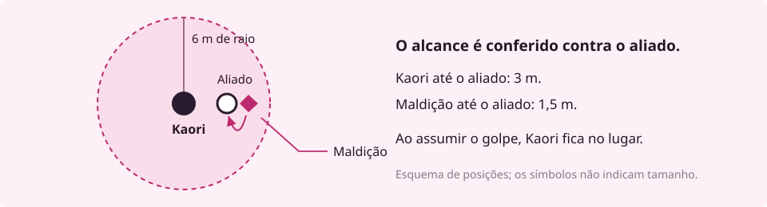

<!-- page:entrada|Entrada no mundo -->

PROJETO - M · MANUAL DA GUILDA

# Resgate na ala oeste

Um RPG de mesa no universo de Jujutsu Kaisen

Uma funcionária da escola se trancou no arquivo depois de ser atacada no corredor. Ela conseguiu pedir socorro pelo celular. Kaori e sua equipe chegam à ala oeste para buscá-la.

A maldição está diante do arquivo. Tem o tamanho de um cachorro grande, braços compridos e unhas que deixam sulcos na porta. Do outro lado, a funcionária responde quando Kaori chama seu nome.

Kaori sabe que precisa chegar perto para usar sua técnica: tudo que prende entre as mãos fica mais pesado. Ela pede ao colega que cuide da retirada da funcionária enquanto ela enfrenta a criatura.

**Neste exemplo, Kaori escolhe lutar para abrir caminho. Na sua mesa, você poderia propor outra saída: atrair a maldição para longe ou procurar um segundo acesso ao arquivo.**

Em **Projeto - M**, você cria um personagem e decide o que ele tenta fazer. Os outros jogadores fazem o mesmo com os personagens deles. Vocês podem formar uma equipe enviada para enfrentar maldições, investigar desaparecimentos ou proteger alguém ameaçado.

Uma pessoa assume o papel de **mestre**: apresenta os lugares, interpreta quem vocês encontram e conduz as ameaças. Quando você tenta algo de resultado incerto e a falha tem consequências, as regras e os dados ajudam a resolver a tentativa.

O mestre descreve o que mudou, e o grupo decide como continuar. Na escola, vencer a maldição abre o caminho para o resgate; ainda é preciso tirar a funcionária do prédio.

<strong>Seu começo</strong> 
<a href="#mundo">Conheça o mundo</a> · <a href="#mesa">Aprenda a primeira rolagem</a> · <a href="#kaori">Jogue a cena da Kaori</a>

Material de fã baseado na obra de Gege Akutami. Kaori e esta missão são exemplos do Projeto - M. Amostra editorial 2, sobre as regras da v0.331.

<!-- page:mundo|O mundo e seus personagens -->
# O mundo que você vai jogar

No universo de **Jujutsu Kaisen**, maldições nascem das emoções negativas humanas e podem ferir e matar. Feiticeiros usam **jujutsu**, ligado à energia amaldiçoada, para exorcizá-las. Você joga com alguém envolvido nesse conflito, com os poderes e limites da Origem escolhida.

O trabalho pode levar uma equipe a uma escola, a um prédio interditado ou à casa de alguém que parou de responder às mensagens. Às vezes, a equipe sabe quem precisa de ajuda, como no resgate da escola. Em outras missões, terá de investigar para encontrar a ameaça. O mestre apresenta o que vocês sabem; o grupo decide onde procurar e quando lutar.

## Um poder que tem a sua marca

Uma técnica pode partir de uma ideia muito específica. Kaori torna mais pesado o que prende entre as mãos. O feitiço apresentado aqui exige que ela chegue perto e toque o alvo. Como Bastião, ela também dispõe de habilidades para proteger a equipe nesse confronto. Outra pessoa poderia imaginar uma técnica ligada a sombras, palavras ou objetos cotidianos, e explorar suas possibilidades ao longo da campanha.

O sistema chama de **Fundamento** a base que descreve a técnica e reúne as escolhas usadas para construir suas aplicações. Cada **feitiço** é uma aplicação com efeito e regras de uso definidos. A criação orienta você a transformar a ideia em algo que toda a mesa consiga entender e arbitrar.

Existem também outras rotas de poder. Você pode jogar com alguém sem técnica inata, um receptáculo ou um corpo amaldiçoado. A **Origem** escolhida informa quais regras usar. O livro explica cada rota no momento de montá-la; ninguém precisa conhecer todas para começar.

## O que mantém a equipe junta

Uma ordem pode reunir desconhecidos na primeira missão. O que acontece depois depende deles. Um colega que assume um golpe por você pode ganhar sua confiança. Uma família que esconde informações sobre a missão pode perdê-la. Entre as saídas, os personagens treinam, tratam dos ferimentos e lidam com as consequências do que fizeram.

Kaori cresceu ouvindo que seu clã havia perdido prestígio. A avó lhe ensinou a reconhecer ervas; a família esperava que ela recuperasse o valor do sobrenome. Em campo, Kaori se preocupa com algo mais imediato: trazer todos de volta. Ela precisa decidir até onde aceita as exigências da família quando elas colocam a equipe em risco.

<strong>A Guilda e a sua mesa</strong>

Aqui, <strong>Guilda</strong> é a comunidade de jogadores organizada em um servidor. O projeto foi feito para que o mesmo personagem participe de mesas de diferentes mestres, mantendo sua ficha e sua história. O termo não nomeia uma instituição obrigatória do mundo ficcional.

Antes de começar, combinem época e lugar da campanha, relação entre os personagens e limites para os temas das cenas. A escola deste exemplo é uma possibilidade de começo.

<!-- page:mesa|Da conversa à rolagem -->
# Da conversa à rolagem

Você precisa de uma ficha, um meio de anotar mudanças e dados físicos ou um rolador digital. A letra **d** indica um dado; o número depois dela indica suas faces. **d20** vai de 1 a 20. **3d8** significa rolar três dados de oito faces e somar os resultados.

A ficha reúne as características e habilidades do personagem. Ela também registra recursos que mudam durante a missão, como **Vida**, reduzida quando você sofre dano, e **Pontos de Energia (PE)**, gastos nas habilidades que cobram esse recurso.

## Declare o que pretende fazer

Antes de chegar ao corredor da ala oeste, a equipe encontrou uma grade no acesso lateral. Veja como a mesa resolve essa tentativa.

**Mestre:** “Há uma grade travada no acesso lateral. Vocês escutam passos se aproximando.”

**Jogadora:** “Kaori tenta abrir a grade à força para o grupo passar.”

A tentativa tem dificuldade e o tempo importa. O mestre pede um teste de **Atletismo**, perícia usada em tarefas de esforço físico, e estabelece **Classe de Dificuldade (CD) 14** para este caso. A CD é o total que o teste precisa alcançar.

Kaori tem **Força 3** e é treinada em Atletismo. Por esse treino, soma sua **maestria 1**, o bônus de treinamento do nível dela. Seu teste é **d20 + 4**.

10 <small>no d20</small><b>+</b>4 <small>de bônus</small><b>=</b>14 <small>igual à CD</small>

**Igualou ou superou a CD: conseguiu.** Kaori força a grade a tempo. O grupo decide quem passa primeiro e o mestre descreve o que vê do outro lado. Se a rolagem falhar, a consequência depende da situação: perder tempo, fazer barulho ou descobrir um impedimento que exija outra abordagem.

## Quando a vantagem entra

Uma regra pode dar **vantagem**: role dois d20, escolha o maior e some o bônus. Com **desvantagem**, escolha o menor. Se os dados forem 7 e 16, o teste com vantagem e bônus +4 dá 20; com desvantagem, dá 11.

Não é preciso rolar para toda fala ou gesto. Quando a tarefa pode acontecer sem dificuldade relevante, o mestre descreve o resultado e a conversa segue. Uma **cena** acompanha uma situação; ela termina quando o grupo a resolve, abandona ou passa a lidar com outra. A sessão pode conter várias cenas.

<strong>Em combate</strong> Um ataque compara seu total com a <strong>Defesa</strong> do alvo. Os turnos organizam a ordem e os recursos de cada participante. A próxima cena mostra essa resolução com os números já preenchidos.

<!-- page:kaori|Kaori e o feitiço da cena -->
# Kaori, antes de entrar

**Descendente · Bastião · Trilha Muro · Nível 2**

Kaori chega à ala oeste com 23 de Vida e 8 PE. Seu objetivo é afastar a maldição da porta para que a equipe resgate a funcionária. Abaixo está o recorte de ficha necessário para acompanhar este combate. O restante do repertório não faz parte desta amostra.

<strong>23/23</strong>VIDA ATUAL / MÁXIMA

<strong>8/8</strong>PE ATUAIS / MÁXIMOS

<strong>13</strong>DEFESA

<strong>9 m</strong>DESLOCAMENTO

| Na ficha | O que você usa nesta cena |
|---|---|
| **Iniciativa** | d20 + 2, para saber quando Kaori age. |
| **Ataque de conjuração** | d20 + 4, para tentar acertar Peso nas Mãos. |
| **Força 3 e maestria 1** | São os dois valores que formam o +4 do ataque. Força é o atributo escolhido para a técnica de Kaori. |
| **Ação de Movimento** | Permite percorrer até 9 m no turno. Kaori pode dividir essa distância antes e depois de agir. |
| **Ação Padrão** | Será usada para conjurar o feitiço. |
| **Ação Bônus** | Pode ativar Olhos Em Mim, explicado na <a href="#protecao">amostra de proteção</a>. |
| **Reação** | Responde a um gatilho e se recupera no começo do turno de Kaori. Não será gasta no ramo principal. |

FEITIÇO DA KAORI · CLASSE 1 · TOQUE

## Peso nas Mãos

**Ação Padrão · 3 PE · um alvo a até 1,5 m**

Kaori encosta as palmas uma na outra e toca o alvo com as duas mãos. Role **d20 + 4 contra a Defesa** dele. Se acertar, causa **3d8 de dano de Concussão** e deixa o alvo **Derrubado por 1 rodada**.

O gesto de unir as palmas é o **Selo**, a exigência da técnica para conjurar. Kaori precisa ter as mãos disponíveis. O custo de **3 PE é pago ao conjurar**, mesmo que o ataque erre.

**Derrubado:** o alvo só se move rastejando, com metade do deslocamento, e tem desvantagem em seus ataques. Ataques contra ele têm vantagem a até 1,5 m e desvantagem de mais longe. Este feitiço impõe uma duração; gastar a Ação de Movimento para se levantar é a saída para quedas sem duração definida.

Classe determina orçamento, custo e limites do feitiço. Use este feitiço pronto na cena; sua montagem fica no capítulo Fundamento.

<!-- page:combate|Uma rodada na ala oeste -->
# Uma rodada na ala oeste

Kaori avança pelo corredor. A maldição abandona a porta e vem ao encontro dela. A luta começa com as duas a **1,5 m de distância**; a porta do arquivo está a **3 m de Kaori**. Os colegas aguardam a passagem ficar livre para alcançar o arquivo e não agem neste recorte didático.

<strong>Maldição Menor · dados deste exemplo</strong> Vida 14 · Defesa 12 · Iniciativa d20 + 3 Ataque com garras: d20 + 3 · alcance 1,5 m · dano 1d6 + 2 Cortante

## 1. Descobrir quem age primeiro

Cada participante rola **Iniciativa: d20 + Destreza**. Kaori tira **11 + 2 = 13**. A maldição tira **16 + 3 = 19**, então age primeiro. A ordem permanece durante o combate.

Cada participante tem um **turno**. Depois que todos agem, termina a **rodada**; a próxima segue a mesma ordem. Uma rodada representa cerca de seis segundos.

## 2. Receber o primeiro ataque

A maldição ataca Kaori. Neste exemplo, ela usa sua Defesa fixa, 13. O mestre tira **14 no d20 + 3 = 17**. O ataque acerta, pois 17 supera 13.

O dano é **1d6 + 2**. O dado mostra **3**; somando 2, são **5 de dano**. Kaori anota **23 − 5 = 18 de Vida**. Olhos Em Mim ainda não está ativo, portanto a proteção de Alicerce não se aplica.

## 3. Usar Peso nas Mãos

Kaori já está ao alcance. Ela junta as palmas, toca a criatura e gasta sua **Ação Padrão** para conjurar. Paga **3 PE: de 8, fica com 5**.

A jogadora tira **12 no d20 + 4 = 16**, contra Defesa 12. Acertou. Nos três d8 saem **4, 5 e 5**, totalizando **14 de dano**. A Vida da maldição vai de 14 a 0; ela cai no corredor.

## 4. Chegar à porta

Kaori usa a Ação de Movimento para andar os **3 m até o arquivo**. Dos 9 m de deslocamento, restam **9 − 3 = 6 m** que ela poderia percorrer nesse turno. Ela para junto da porta.

<strong>Neste ponto do turno</strong> Kaori: <strong>18 de Vida · 5 PE</strong>. Ação Padrão usada. Movimento: 3 m percorridos, 6 m restantes. Ação Bônus e Reação disponíveis. Olhos Em Mim permanece inativo.

Kaori poderia ter usado a Ação Bônus para abrir Olhos Em Mim e ainda conjurar no mesmo turno: os recursos são independentes. Este primeiro exemplo resolve apenas o feitiço; a proteção do Bastião aparece mais adiante. Se o ataque tivesse errado, o custo de 3 PE e a Ação Padrão continuariam gastos.

Com o corredor livre, o grupo chama a funcionária e avisa que ela pode abrir a porta. A mesa volta à conversa para resolver o resgate. O fim da luta, por si só, não recupera a Vida ou os PE gastos.

<!-- page:personagem|Comece o seu personagem -->
# Crie seu personagem

Comece com alguém que você queira acompanhar por mais de uma missão. Escreva o que essa pessoa deseja e por que participa da equipe. Isso ajuda a escolher entre opções que, nos números, parecem igualmente boas.

Você pode imaginar alguém pressionado por uma família de feiticeiros, uma pessoa que descobriu o mundo jujutsu tarde demais para voltar à vida anterior ou um corpo amaldiçoado tentando construir uma rotina própria. A criação transforma essa ideia em escolhas na ficha.

## Origem, Caminho e Trilha

A **Origem** explica de onde vem seu poder e indica sua rota de criação. Um **Caminho** reúne habilidades que moldam sua atuação. A **Trilha**, escolhida dentro dele, especializa essa atuação. A criação padrão começa no **nível 2**, com uma escolha de cada.

Kaori é **Descendente** por sua ligação com um clã, **Bastião** pelas habilidades de proteção e **Muro** por sua forma de resistir à pressão. Uma outra Descendente poderia escolher um Caminho diferente.

| Caminho | Uma possibilidade de atuação |
|---|---|
| **Bastião** | Assumir ataques dirigidos a aliados e sustentar o confronto. |
| **Vanguarda** | Pressionar adversários com armas e explorar suas oportunidades de ataque. |
| **Guia** | Apoiar a equipe com recursos que mudam conforme a Trilha. |
| **Emanador** | Fazer da técnica o centro de sua atuação em combate. |
| **Evocador** | Aprimorar o vínculo e o trabalho com suas invocações. |
| **Incursor** | Usar movimento e gastar Fluidez, o recurso do Caminho, para criar oportunidades no confronto. |

<strong>Uma vontade, uma escolha</strong>

“Quero ser a pessoa que fica quando o resto da equipe precisa recuar.” Essa ideia leva a jogadora da Kaori a examinar o Bastião. Ao ler Muro, ela encontra <strong>Alicerce</strong>: proteção contra dois tipos de dano escolhidos depois do descanso longo, enquanto Olhos Em Mim está ativo.

A escolha responde a algo que ela quer fazer em cena. Depois, a jogadora confere os custos, os limites e como a habilidade combina com o restante da ficha.

ORIGEM<strong>Descendente</strong>

CAMINHO<strong>Bastião</strong>

TRILHA<strong>Muro</strong>

Recorte de ficha: registre cada escolha no seu próprio campo. As descrições acima orientam a busca; o catálogo completo contém os benefícios e requisitos.

<!-- page:criacao|Da ideia à ficha -->
# Da ideia à ficha

Siga esta ordem: **Origem, Regra da técnica, Caminho e Trilha, atributos, poder completo, treinos e números da ficha**. Pactos entram por último, se houver.

## Escreva a ideia do poder

A Regra descreve o que a técnica faz com o mundo. Kaori escreve: **“Tudo que eu prendo entre as minhas mãos fica mais pesado.”** Essa frase orienta a construção dos feitiços; dano, alcance e efeitos dependem das regras de montagem.

Antes de continuar, outra pessoa deve conseguir explicar essa frase com as próprias palavras. Se a sua Origem usa uma rota diferente, siga o capítulo indicado por ela para desenvolver o poder.

## Distribua os atributos

Na criação padrão, distribua **9 pontos** entre Força, Destreza, Constituição, Inteligência e Essência. **Nenhum pode ficar acima de 3.** O próprio valor do atributo é o bônus; você não precisa convertê-lo por outra tabela.

| Força | Destreza | Constituição | Inteligência | Essência |
|---:|---:|---:|---:|---:|
| 3 | 2 | 2 | 1 | 1 |

Essa é a distribuição de Kaori: **3 + 2 + 2 + 1 + 1 = 9**. Força sustenta sua atuação de perto. Ela também escolhe Força como atributo da técnica, conforme as regras do Fundamento; por isso o ataque de conjuração soma Força 3 e maestria 1.

## O que ainda falta preencher

| Etapa | Decisão ou registro |
|---|---|
| **Poder completo** | Siga a rota da Origem. No Fundamento, defina atributo da técnica, Famílias, Selo, Passivas e feitiços, além da Regra já escrita. |
| **Treinos e Legados** | Registre perícias, ofícios, Testes de Resistência treinados e benefícios da Origem. Confira a fonte de cada escolha. |
| **Equipamento e números** | Escolha o equipamento permitido e calcule Vida, PE, Defesa e os demais valores com a tabela do nível inicial. |
| **Pactos** | A ficha pode começar sem pacto. Se quiser um, siga os requisitos da forma disponível na criação. |

Um **Teste de Resistência (TR)** é uma rolagem para resistir a um efeito; o efeito informa qual TR usar. **Legados** são benefícios escolhidos nas listas da Origem. Essas escolhas têm regras próprias, apresentadas no roteiro completo.

<a href="#consulta">Continue a criação no livro: veja os capítulos na página de consulta.</a>

<!-- page:protecao|Proteção do Bastião -->

AMOSTRA DE REGRA PARA CONSULTA

# Proteção do Bastião

Kaori recebeu **Olhos Em Mim**, do Bastião, e **Alicerce**, da Trilha Muro, no nível 2. A área permite proteger um aliado; Alicerce reduz determinados danos que ela própria recebe. Esta página reúne as regras usadas no exemplo seguinte.

## Olhos Em Mim

**Ação Bônus · raio de 6 m · até o fim da cena**

Você usa **Força nos testes de Provocar e Intimidação**, no lugar de Essência.

Com uma Ação Bônus, estabeleça uma área de 6 m ao seu redor. Ela acompanha você e pode ser encerrada como ação livre no seu turno.

**Provocação inicial, uma vez por cena.** Ao ativar a área, escolha inimigos dentro dela, até o limite de metade da sua Força, arredondada para baixo, mais um. Faça um teste de Provocar contra o TR de Espírito de cada um. Quem falhar sofre o efeito de Provocar até o começo do seu próximo turno. Inimigos que entrarem depois não recebem essa provocação inicial.

**Assumir um golpe.** Com a área ativa, quando uma criatura declarar um ataque com rolagem contra um aliado dentro dela, você pode gastar sua **Reação, antes da rolagem de acerto**, para se tornar o alvo desse ataque.

O atacante compara sua rolagem com sua Defesa, ou com seu Bloquear, se você escolher bloquear. Bloquear não exige outra Reação. O ataque conserva o alcance já declarado contra o aliado, e você o intercepta sem se mover.

Se acertar, você recebe o dano e os efeitos do golpe, inclusive o crítico. Se errar, nenhum dos dois recebe o golpe. A Reação protege **somente o ataque declarado**, não os demais ataques da ação.

## Alicerce

**Trilha Muro · benefício do nível 2**

Ao fim de cada descanso longo, escolha **dois tipos de dano**. Enquanto Olhos Em Mim estiver ativo, você recebe **metade do dano** desses tipos. Kaori escolheu Cortante e Concussão para estes exemplos.

**O efeito de Provocar:** até o começo do próximo turno de quem provocou, o alvo afetado ataca essa pessoa com vantagem e as outras criaturas com desvantagem. Para Kaori, a provocação inicial alcança até **2 inimigos**; seu teste é **d20 + 4** contra o TR de Espírito de cada um.

O exemplo seguinte começa com a área já ativa e a provocação inicial encerrada. Ele demonstra a proteção de um aliado, sem precisar resolver outra tentativa de Provocar.

<!-- page:interceptar|O ataque contra um aliado -->
# O ataque contra um aliado

**Outra situação.** Kaori está com **18 de Vida e 5 PE**, Olhos Em Mim ativo e sua Reação disponível. A provocação inicial já terminou. Um colega está a **3 m dela**, dentro da área. A maldição está a **1,5 m desse colega**, ao alcance das garras, e declara um ataque contra ele.

## Declare a Reação antes do dado

A jogadora diz: **“Kaori assume esse golpe.”** Ela gasta a Reação e vira o alvo. O mestre só então rola o ataque. A posição de Kaori permanece igual; a habilidade conserva o alcance que já permitia atingir o aliado.

O mestre tira **11 no d20 + 3 = 14**. Veja duas resoluções alternativas desse mesmo ataque:

| Defesa de Kaori | Resolução |
|---|---|
| **Usar Defesa 13** | O total 14 acerta. O dano é 4 no d6 + 2 = **6 Cortante**. Alicerce reduz pela metade: **3**. Kaori fica com **15 de Vida e 5 PE**. O aliado não recebe o golpe. |
| **Escolher Bloquear** | Kaori rola **2d10 + (Defesa − 11)**: com Defesa 13, fica **2d10 + 2**. Os dados dão 7 e 6: **7 + 6 + 2 = 15**. O ataque 14 erra. Kaori fica com **18 de Vida e 5 PE**. Nenhum dos dois recebe o golpe. |

**Escolha uma das duas resoluções para esse ataque.** Em ambas, a Reação de Kaori foi gasta para assumir o golpe e só volta no começo do turno dela. Bloquear não cobra outra Reação.

## Os limites que fazem diferença

Kaori não pode esperar o resultado do ataque contra o aliado para decidir interceptá-lo. Um ataque que peça apenas TR também não atende ao gatilho de Assumir um golpe. Se o inimigo tiver outro ataque, a Reação já usada não protege automaticamente o segundo.

**Bloquear tem extremos:** dois 10 impedem o acerto, salvo um 20 natural do atacante. O contra-ataque de Aparar exige Reação, que Kaori já gastou aqui. Com dois 1, o ataque acerta e o agressor pode gastar a própria Reação para atacar de novo. A regra completa está em Como Jogar, seção Bloquear.

<!-- page:consulta|Continue por aqui -->
# Continue por aqui

Você já acompanhou uma tentativa fora de combate, um turno de conjuração e a proteção de um aliado. Para criar sua ficha ou resolver situações além desses exemplos, abra o trecho correspondente do livro vigente.

| Quero… | No Manual da Guilda v0.331 |
|---|---|
| **Criar meu personagem** | Capítulo 6, **Criação de Personagem**: comece pela Ordem dos passos. |
| **Escolher a origem do poder** | Capítulo 7, **Origens e Legados**: leia Efeito na ficha da opção escolhida. |
| **Comparar Caminhos e Trilhas** | Capítulo 8, **Caminhos e Trilhas**: leia o Caminho e suas três Trilhas. |
| **Montar uma técnica e seus feitiços** | Capítulo 9, **Fundamento**: Escrevendo o seu Fundamento e Criando feitiços. Outras rotas são indicadas pela Origem. |
| **Saber o que posso fazer no turno** | Capítulo 2, **O Turno**: Recursos do turno e as listas de ações. |
| **Entender Defesa e Bloquear** | Capítulo 1, **Como Jogar**: Defesa e Bloquear. |
| **Resolver uma condição ou Vida a 0** | Capítulo 4, **Dano, Condições e Cobertura**; para Vida a 0, capítulo 1, seção de mesmo nome. |
| **Recuperar recursos** | Capítulo 5, **Descanso e Recuperação**. |

## Voltar aos exemplos desta amostra

- <a href="#mesa">Teste de Atletismo: dado, bônus e dificuldade.</a>
- <a href="#kaori">Ficha reduzida e Peso nas Mãos.</a>
- <a href="#combate">Uma rodada com recursos antes e depois.</a>
- <a href="#protecao">Olhos Em Mim e Alicerce.</a>
- <a href="#interceptar">Assumir um golpe, com Defesa ou Bloquear.</a>

<strong>Experimente mudar uma decisão</strong>

No combate da ala oeste, imagine que o ataque de Peso nas Mãos tenha errado. Quanto de energia resta à Kaori? Ela ainda pode usar a Ação Bônus nesse turno? Consulte a ficha e a sequência antes de responder.

Depois, imagine que o aliado esteja a 7 m de Kaori. O que muda na possibilidade de assumir o golpe? A resposta depende da posição e do raio da área.

Referências da **v0.331**. Esta amostra inicia a criação; use o roteiro completo para terminar a ficha.
